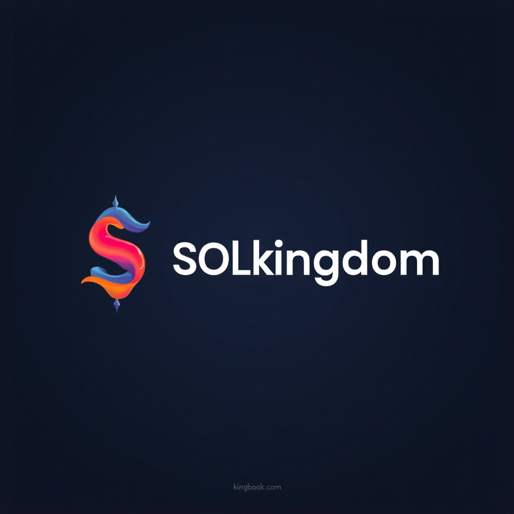

# What is SOLkingdom?

<figure><figcaption></figcaption></figure>

## SOLkingdom Overview

SOLkingdom is an innovative platform that intertwines a wide array of blockchain games and community engagement tools, all revolving around the Kingdom Coin (KC) token. At its foundation, SOLkingdom aims to offer a seamless and immersive experience into the world of cryptocurrency gaming. As the platform launches, it will introduce several key features:

* **Degen Trader**: This is a thrilling crypto-market simulation inspired by classic games like _Drug Wars / Dope Wars_. Participants can engage in simulated trading, mimicking the exciting and volatile nature of real-world crypto markets, providing both entertainment and strategic depth.
* **SOLar Mission**: A fast-paced and exhilarating crash game, SOLar Mission utilizes provably fair mechanics to ensure transparency and fairness. Players can experience the adrenaline rush of crash games that test both reflexes and decision-making under pressure, delivering a truly engaging experience.
* **Virtual BTC Referral Program**: Designed as a meme-driven, viral sharing and rewards system, this program encourages community growth through incentivized referrals. Participants can share their love for SOLkingdom with friends, earning rewards in a playful and engaging manner, thereby promoting organic expansion.
* **SOLkingdom.com**: Serving as the Decentralized web platform, SOLkingdom.com is the core hub for accessing gameplay, participating in staking, tracking leaderboards, and claiming rewards. It is designed to be user-friendly, offering a one-stop destination for all user interactions within the ecosystem.

All these activities within the SOLkingdom ecosystem, whether it’s engaging in gameplay, participating in staking, or leveraging referrals, are integrally connected through the KC token. This token acts as the lifeblood of the ecosystem, enabling smooth transactions and fostering a cohesive environment for users. The platform also employs sophisticated mechanisms such as token utility, burn mechanics, and a unique points-to-APR staking boost system. These features are intricately designed to enhance user engagement, promote sustained interaction, and ensure long-term platform vitality.

Through this carefully constructed ecosystem, SOLkingdom not only creates an entertaining and rewarding experience for users but also contributes to the broader blockchain community by fostering an engaged and vibrant user base.
