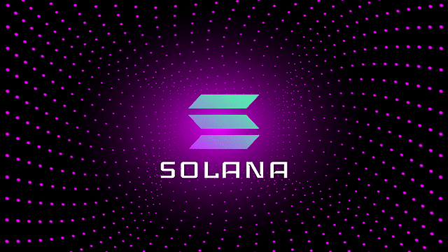

# Why Solana?

<figure><figcaption></figcaption></figure>

The Solana has the core loop (short sessions, frequent outcomes, live leaderboards, constant claims) demands speed, cost-efficiency, and composability:

#### **Ultra‑low fees & high TPS:**&#x20;

Sub‑second confirmations and negligible fees enable on-chain checks for _every_ round/session without harming UX.

#### **Anchor + Rust developer ergonomics:**

Clear, auditable program structure (PDAs, accounts, constraints) improves security and velocity.

#### **Rich wallet and SDK ecosystem:**

First‑class support for Phantom, Solflare, Backpack, Ledger, mobile deep links, and the Wallet Standard makes onboarding smooth.

#### **On-chain transparency:**&#x20;

RNG seeds, results, burns, and prize flows are visible on-chain—vital for trust in games of chance and competitive leaderboards.
